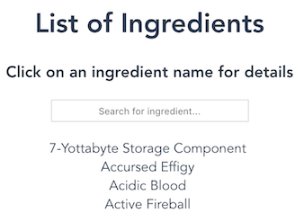

# My History

## 2020

### Scheme - 2020/12

Schemeの授業に影響されて、GoでSchemeっぽい言語のinterpreterを作った。

- <i class="fab fa-github github"></i>
  [list-interpreter](https://github.com/motoki317/lisp-interpreter)

### ISUCON10 - 2020/10

チーム「Azeit」として、全体2位、学生2位を取った。
主に雑用を担当していた気がする。

### c-compiler - 2020/08

大学の演習の授業（「プログラミング創造演習」）で何を作っても良いとのことだったので、
Cコンパイラを途中まで作った。
C言語や、そもそもプログラムがどう動いているのかの勉強になった。

- <i class="fab fa-github github"></i>
  [titech-cpp/c-compiler](https://github.com/titech-cpp/c-compiler)
- 参考: [低レイヤを知りたい人のためのCコンパイラ作成入門](https://www.sigbus.info/compilerbook)

### traq-music-station - 2020/08

Seleniumを使い、traQの通話機能「Qall」に音楽botをねじ込んだ。
内容はmoto-botからの移植。
traq-bot4jを使っている。

- <i class="fab fa-github github"></i>
  [traq-music-station](https://github.com/motoki317/traq-music-station)

### traq4j, traq-bot4j - 2020/06

traQのAPIクライアントである
[node-traq](https://github.com/traPtitech/node-traq) がOpenAPI-generatorから自動生成されていたので、
Javaのライブラリも自動生成してみた。

- <i class="fab fa-github github"></i>
  [traq4j](https://github.com/motoki317/traq4j) 
  
- <i class="fab fa-github github"></i> 
  [traq4j](https://github.com/motoki317/traq-bot4j) 
  

### traq-message-indexer - 2020/05

traQのメッセージ検索をするbotを書いた。
MySQL/MariaDBのCJK-character fulltext index用Engine`Mroonga`を使っています。

- <i class="fab fa-github github"></i> 
  [traq-message-indexer](https://github.com/motoki317/traq-message-indexer)

### moto-bot v2 - 2020/04

v1のコードが目も当てられないものだったため、最低限保守できるように一から書き直した。
オープンソースにした。

100以上（2021/02現在、1200以上）のサーバーに参加していたので、
[bot verification](https://blog.discordapp.com/the-future-of-bots-on-discord-4e6e050ab52e)
を出さないといけなかった。
無事にverificationが通り、botとそのownerにバッジが付くなどした。（嬉しい）

- <i class="fab fa-github github"></i> 
  [moto-bot](https://github.com/motoki317/moto-bot)

## 2019

### ポートフォリオ - 2019/05

ここ - VuePressを使って生やした。

### 簡単なフロントエンド - 2019/05

traPの講習会で教えてもらったVue.jsを使い簡単なサイトを作ってみる。

- <i class="fab fa-github github"></i>
  [Wynn Ingredients Searcher](https://wynn-ingreds-searcher.netlify.com/)

## 2018

### moto-bot （Discord bot）

プログラミング始めとして、DiscordのBotを書いた。

- [Botについて](https://forums.wynncraft.com/threads/discord-bot-for-wynn-utility-commands-moto-bot.223425/)
- [Invite Link](https://discordapp.com/oauth2/authorize?client_id=418413540857085972&scope=bot&permissions=93248)

言語はJava、ライブラリはJDA（Java Discord API）を使用。
主に[Wynncraft](https://wynncraft.com)（Minecraftのサーバー）のAPIを使って便利そうな機能を
追加しまくっていたらいつの間にか肥大化していた。
DiscordのVC（Voice Chat）上で音楽が聴けたりする。
