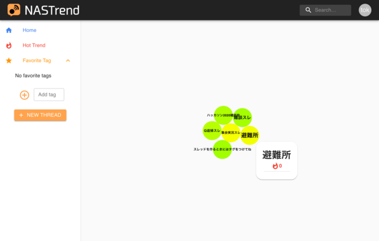

# My Works

## Team Projects

- [traQ](https://github.com/traPtitech/traQ)
  - traP部内チャットツール。
  - 開発を引き継ぎ、メンテナンスを担当。
  - [個人公開インスタンス](https://q.toki317.dev/)
  
- [NASTrend](http://nastrend.morning-chun-friends.trap.show/)
  - traP 2020年夏ハッカソンで作った「すごい熱いSNS」。スレッドごとにリアルタイムの会話ができる。 
  - サーバーサイド（Go）を担当。
  
- [JapariPark Online](https://japari.toki317.dev/)
  - traPでチーム制作したけものフレンズ2次創作ゲーム。
  - サーバーサイド（Node.js + TS）を担当。
  
- [ISUCON11 本選作問](https://github.com/isucon/isucon11-final)
  - traPとしてISUCON11の作問に参加。
  - 主に本選のGo参考実装、ベンチマーカーを担当。

## Personal Projects

- [moto-bot (Discord Bot)](https://github.com/motoki317/moto-bot)
  - プログラミングを始めて最初の制作物。とあるゲームサーバーのAPIを利用して、データの集計等を行う。音楽再生機能付き。
  - サーバー数が結構伸びたので、[Verification](https://blog.discordapp.com/the-future-of-bots-on-discord-4e6e050ab52e) 済み。
  
- [traq-message-indexer](https://github.com/motoki317/traq-message-indexer)
  - traQのメッセージ検索用Bot。MySQL/MariaDBのCJK-character fulltext index用Engine `Mroonga` を使用。
  - 現在はtraQ本体にメッセージ検索機能が実装されたため、使っていない。
- [traq4j](https://github.com/motoki317/traq4j), [traq-bot4j](https://github.com/motoki317/traq-bot4j), [traq-ws-bot4j](https://github.com/motoki317/traq-ws-bot4j)
  - traQのBot制作用Javaライブラリ。
  - GitHub pagesをrepositoryの代わりとして使っている。
- [traq-music-station](https://github.com/motoki317/traq-music-station)
  - traQの通話機能「Qall」用音楽再生Bot。
  - Seleniumとheadless-chromeを使って無理やりSkywayに流し込む、かなりな力技実装をしている。
- [titech-cpp/c-compiler](https://github.com/titech-cpp/c-compiler)
  - 大学の演習「プログラミング創造演習」で、Cコンパイラを途中まで作った。[簡単なプログラム](https://github.com/titech-cpp/c-compiler/blob/39a1294527f1f260e02ca0b39e4fa12a7253d4b9/compiler/test/sudoku_solver.c) ならコンパイルできる。
- [list-interpreter](https://github.com/motoki317/lisp-interpreter)
  - 大学の授業に影響されて、GoでSchemeのinterpreterのようなものを作った。
- [portfolio](https://github.com/motoki317/portfolio)
  - これ。Vuepressを使って簡単に生やした。

## Other Experiences

大会出場経験
- [ICTSC2019](https://icttoracon.net/archives/category/ictsc2019) (本選出場)
- [ICTSC2020](https://icttoracon.net/archives/category/ictsc2020) (本選出場)
- [ISUCON9](https://isucon.net/archives/53570241.html) (予選出場)
- [ISUCON10](https://isucon.net/archives/54704557.html) (本選2位)
- [ISUCON11](https://isucon.net/archives/55821036.html) (本選作問)
