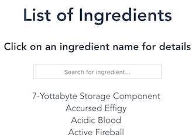

# My Works

作ったもの一覧みたいな

## 2018

### moto-bot （Discord bot）

プログラミング始めとして、DiscordのBotを書いた。

- [Botについて](https://forums.wynncraft.com/threads/discord-bot-for-wynn-utility-commands-moto-bot.223425/)
- [Invite Link](https://discordapp.com/oauth2/authorize?client_id=418413540857085972&scope=bot&permissions=93248)

言語はJava、ライブラリはJDA（Java Discord API）を使用。
主に[Wynncraft](https://wynncraft.com)（Minecraftのサーバー）のAPIを使って便利そうな機能を
追加しまくっていたらいつの間にか肥大化していた。
DiscordのVC（Voice Chat）上で音楽が聴けたりする。

## 2019

### 簡単なフロントエンド

traPの講習会で教えてもらったVue.jsを使い簡単なサイトを作ってみる。
（Vue.jsのRouter初期機能を使っているだけ）

#### [Wynn Ingredients Searcher](https://wynn-ingreds-searcher.netlify.com/)

実用的（にはほど遠い）

#### ポートフォリオ

ここ。
VuePressを使って生やした。

### moto-bot v2

moto-botを今度はオープンソースでリファクタしようとしている。

- [ソース](https://github.com/motoki317/moto-bot)
