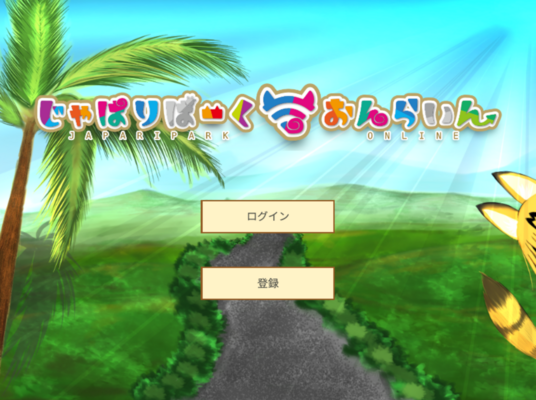

# My Works

## traQ

traP部内チャットツール。
開発を引き継ぎメンテナンスをしている。

- [リポジトリ](https://github.com/traPtitech/traQ)
- [個人公開インスタンス](https://q.toki317.dev/)

## NASTrend

traP 2020年夏ハッカソンで作った「すごい熱いSNS」。
スレッドごとにリアルタイムの会話ができる。

サーバーサイド（Go）を担当。

- [NASTrend](http://nastrend.morning-chun-friends.trap.show/)

## JapariPark Online

traPでチーム制作したけものフレンズ2次創作ゲーム。

サーバーサイド（Node.js + TS）を担当。

- [JapariPark Online](https://japari.toki317.dev/)

